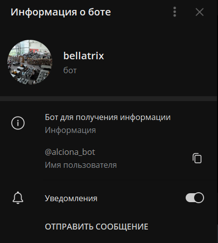
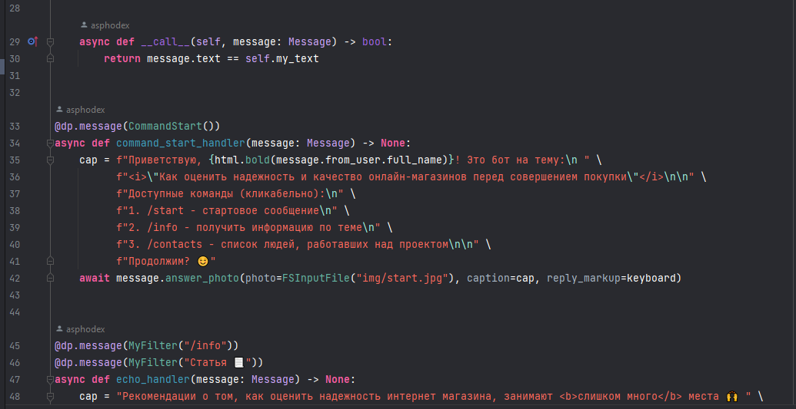

# tg-bot-ocg

Следующий бот написан для практического задания по предмету "Основы цифровой грамотности".
Чтобы им воспользоваться, введите в поиск в мессенджере телеграм @<i>alciona_bot</i>

Также вы можете перейти по ссылке: https://t.me/alciona_bot

В самом репозитории вы можете найти код проекта и ресурсы. В основе проекта
лежит библиотека aiogram3x. Для корректной работы кода рекомендую устанавливать
проект в виртуальное окружение.

Проект был создан студентом 1-ого курса программной инженерии.