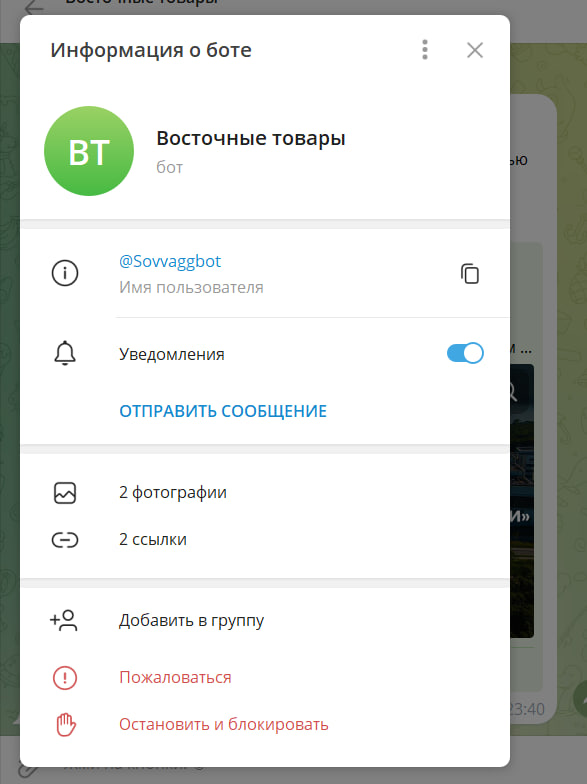

# tg-bot-ocg

Следующий бот написан для практического задания по предмету "Основы цифровой грамотности".
Чтобы им воспользоваться, введите в поиск в мессенджере телеграм @<i>Sovvaggbot</i>

Также вы можете перейти по ссылке: https://t.me/Sovvaggbot

В самом репозитории вы можете найти код проекта и ресурсы. В основе проекта
лежит библиотека aiogram3x. 

Проект был создан студентом 1-ого курса китаеведения.
